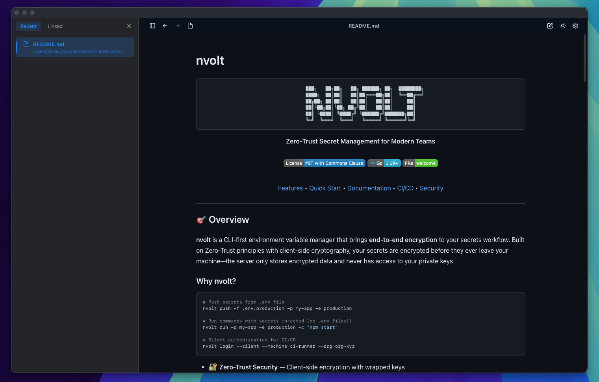
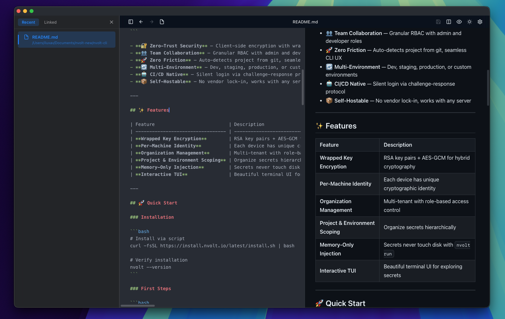
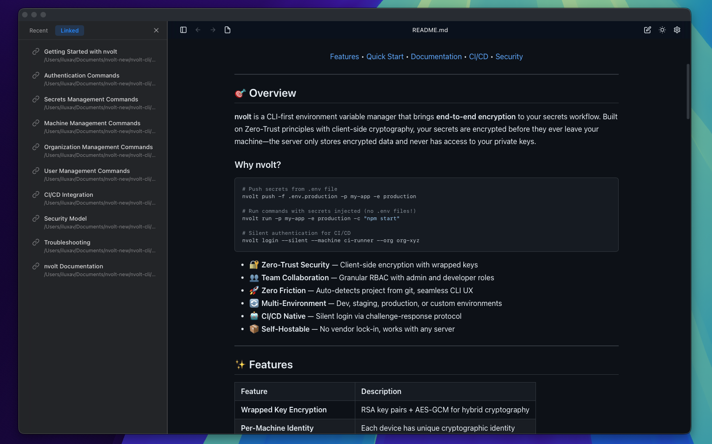

# mdox

A blazingly fast, cross-platform Markdown viewer and editor built with Rust + Tauri + React.



### Markdown Editing



### Linked documents auto discovery



## Features

- **Fast & Lightweight**: Built with Rust and Tauri for native performance
- **Cross-Platform**: Works on macOS, Windows, and Linux
- **Rich Markdown Rendering**: Syntax highlighting, tables, images, and more
- **Live Editor**: Split-view editing with real-time preview
- **Link Discovery**: Automatically finds and displays linked documents
- **File Tree**: Browse and manage markdown files with drag-and-drop
- **Dark/Light Theme**: Toggle between themes with Cmd+T
- **Keyboard Shortcuts**: Full keyboard navigation support

## Installation

### Download Pre-built Binaries

Download the latest release for your platform:

- **macOS**: Download the `.dmg` file (Universal binary for Intel and Apple Silicon)
- **Windows**: Download the `.msi` or `.exe` installer
- **Linux**: Download the `.AppImage` or `.deb` package

[**Download Latest Release →**](../../releases/latest)

### macOS Installation

```bash
# Download and mount the DMG
open mdox_*.dmg

# Drag mdox to Applications folder
# Or run from command line:
/Applications/mdox.app/Contents/MacOS/mdox
```

**Note**: macOS will show a security warning on first launch because mdox is not code-signed with an Apple Developer certificate ($99/year). This is normal for open-source apps. Simply **right-click → Open** to bypass. See [INSTALLATION.md](INSTALLATION.md) for details.

### Windows Installation

```bash
# Run the MSI installer
mdox_*.msi

# Or use the NSIS installer
mdox_*.exe
```

### Linux Installation

```bash
# For AppImage (universal)
chmod +x mdox_*.AppImage
./mdox_*.AppImage

# For Debian/Ubuntu
sudo dpkg -i mdox_*.deb
```

## Usage

```bash
# Open a markdown file
mdox README.md

# Open a remote markdown file
mdox https://github.com/user/repo

# Or launch the app and use the file picker
mdox
```

### Keyboard Shortcuts

| Action           | macOS       | Windows/Linux |
| ---------------- | ----------- | ------------- |
| Open File        | `Cmd+O`     | `Ctrl+O`      |
| Save File        | `Cmd+S`     | `Ctrl+S`      |
| Toggle Edit Mode | `Cmd+E`     | `Ctrl+E`      |
| Search           | `Cmd+F`     | `Ctrl+F`      |
| Toggle Theme     | `Cmd+T`     | `Ctrl+T`      |
| Back             | `Cmd+[`     | `Alt+←`       |
| Forward          | `Cmd+]`     | `Alt+→`       |
| Settings         | `Cmd+,`     | `Ctrl+,`      |

## Development

### Prerequisites

- Node.js 20+ (LTS)
- Rust (latest stable)
- Platform-specific dependencies:
  - **macOS**: Xcode Command Line Tools
  - **Linux**: `libwebkit2gtk-4.0-dev`, `libappindicator3-dev`, `librsvg2-dev`, `patchelf`
  - **Windows**: Microsoft C++ Build Tools

### Setup

```bash
# Clone the repository
git clone https://github.com/yourusername/mdox.io.git
cd mdox.io

# Install dependencies
npm install

# Run in development mode
npm run tauri dev

# Build for production
npm run tauri build
```

### Building from Source

```bash
# Build for your current platform
npm run tauri build

# macOS: Build universal binary (Intel + Apple Silicon)
npm run tauri build -- --target universal-apple-darwin

# The built binaries will be in:
# - macOS: src-tauri/target/release/bundle/dmg/
# - Windows: src-tauri/target/release/bundle/msi/
# - Linux: src-tauri/target/release/bundle/appimage/
```

## CI/CD

This project uses GitHub Actions for automated builds:

- **Build Workflow**: Triggered by version tags and creates build artifacts
- **Release Workflow**: Triggered by version tags and creates GitHub releases with binaries

Both workflows run when you push a version tag. To create a new release:

```bash
# Tag a new version
git tag v1.0.0
git push origin v1.0.0

# GitHub Actions will automatically:
# 1. Build for macOS (Universal), Windows, and Linux
# 2. Create build artifacts (downloadable from Actions tab)
# 3. Create a draft GitHub release
# 4. Upload all binaries as release assets to the release
```

After the workflows complete, you can:
- Download artifacts from the **Actions** tab for testing
- Edit and publish the draft release from the **Releases** page

## Contributing

Contributions are welcome! Please feel free to submit a Pull Request.

## License

MIT License - see LICENSE file for details
