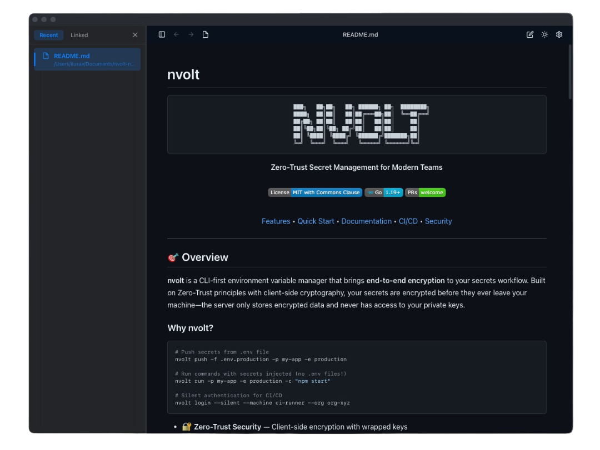
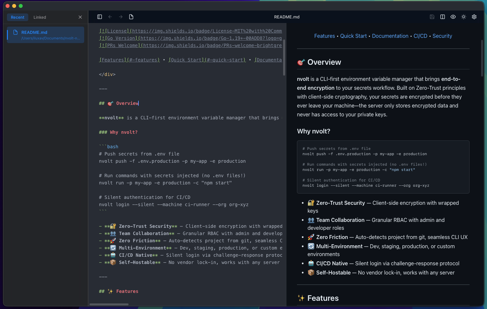
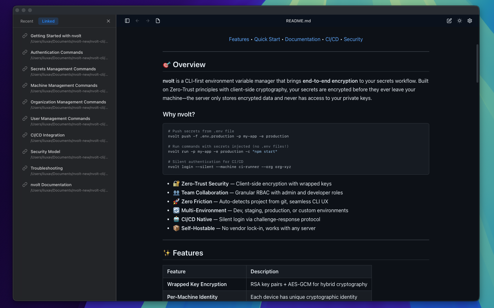

# mdox

A blazingly fast, cross-platform Markdown viewer and editor built with Rust + Tauri + React.



### Markdown Editing



### Linked documents auto discovery



## Development

```bash
# Install dependencies
npm install

# Run in development mode
npm run tauri dev

# Build for production
npm run tauri build
```

## Usage

```bash
# Open a markdown file
mdox README.md

# Or launch the app and use the file picker
mdox
```
